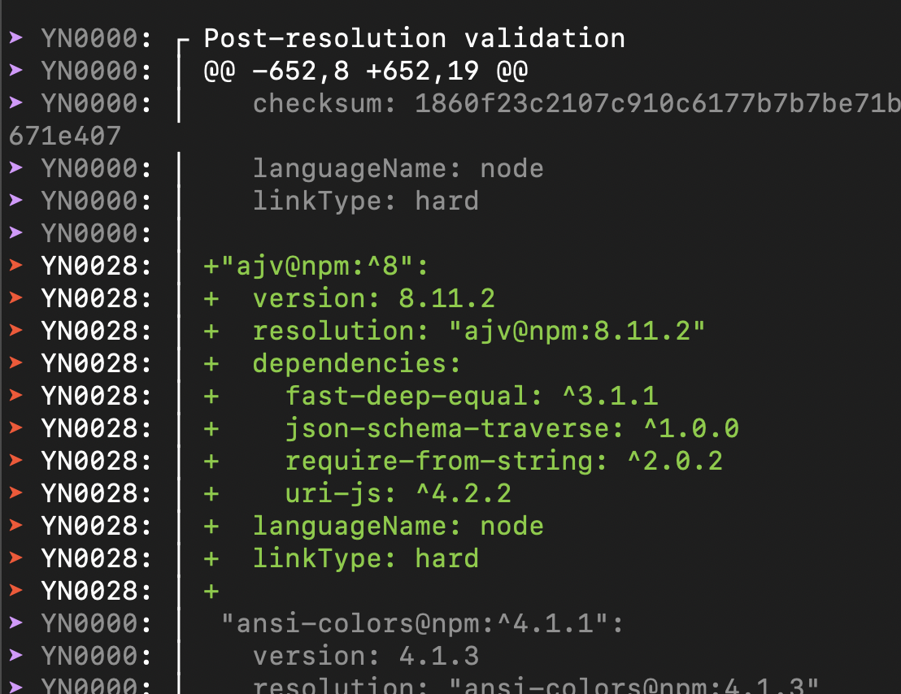

# Overview

This repo was created to provide a reproduction of a possible bug in Turborepo.

There are two significant folders in this project:

## monorepo

This was generated by running:

```bash
npx create-turbo@latest
yarn set version berry
```

All of the code in `monorepo` is what comes by default from running the commands above.

**The only manual change is a resolution for `ajv` in the root package.json.**

```json
  "resolutions": {
    "ajv": "^8"
  },
```

Running turbo prune generated the `out/` directory that is referenced in the `pruned` section below.

```bash
yarn turbo prune --scope=web --docker
```

For illustrative purposes I have removed `out/` from the `.gitignore`.

## pruned

The code in this folder is the result of running turbo prune and moving the code to its own directory.

```bash
mkdir pruned
cp monorepo/out/yarn.lock pruned/yarn.lock
cp monorepo/.yarnrc.yml pruned/.yarnrc.yml
cp -r monorepo/out/json/* pruned
cp -r monorepo/.yarn pruned/.yarn
```

# Bug Report

## What version of Turborepo are you using?

`1.6.3`

## What package manager are you using / does the bug impact

`Yarn 3.3.0`

## What operating system are you using

Mac

## Describe the bug

To optimize our Docker builds we are attempting to use turbo prune to create a lighter weight image. After running prune we copy our pruned lockfile and .json files into a directory and then attempt to run an immutable install.

We have observed that when the root package.json includes yarn resolutions we are unable to run `yarn --immutable` successfully in the _pruned_ monorepo.

### For example

In this reproduction `ajv` is a dependency of `eslint` so it is a necessary dependency in the pruned monorepo.

```
ericjacobson@Erics-MacBook-Air pruned % yarn why ajv
├─ @eslint/eslintrc@npm:0.4.3
│  └─ ajv@npm:6.12.6 (via npm:^6.12.4)
│
├─ eslint@npm:7.32.0
│  └─ ajv@npm:6.12.6 (via npm:^6.10.0)
│
└─ table@npm:6.8.1
   └─ ajv@npm:8.11.2 (via npm:^8.0.1)
```

When the resolution **is not** included in the root package.json the generated `out/yarn.lock` is correct, and includes an `ajv` entry.

When the resolution **is** included in the root package.json then generated `out/yarn.lock` is **incorrect**, and does not include any `ajv` entries.

### Reproducing this behavior

Clone this repo and then either:

Observe that running `yarn --immutable` from `pruned/` fails because the lockfile will be modified



or

From the monorepo directory run an install and note that the `out/yarn.lock` does not include an `ajv` entry when the resolution exists. Remove the resolution from the package.json, run an install and then run `yarn turbo prune --scope=web --docker`. Note that the generated `out/yarn.lock` now includes an `ajv` entry.
